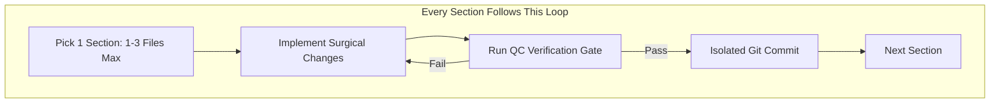

# 🚀 LocalDoc.org — Modular Master Execution Plan to 9.4+ / 10
## Controlled Micro-Sprints • Strict Quality Verification Gates • Zero Mass-Breakage

> **Based on Audit of Commit `9e5df1d` (Current Score: 6.8/10, AdSense Chance: 30–50%)**  
> **Target Score: 9.4 – 9.5 / 10 | Target AdSense Approval: 85–95% (High Tier)**  
> **Founder & Engineer:** Amaad Mazari (Amaad ud din Khan)  
> **Headquarters:** Rojhan, Punjab, Pakistan (Postal Code 33700)  
> **Direct Channels:** WhatsApp (`+92 315 0750652`) • YouTube (`@Localdoc-org`) • Facebook (`profile.php?id=61595067776430`) • Email (`Amaadmazari@gmail.com`)  
> **Core Architecture:** 100% Client-Side In-Memory WebAssembly (Zero-Upload Privacy Engine)

---

## The Philosophy: Why "Mass Changes" Failed & How Micro-Sections Fix It

Over the past 3 months, large-scale mass updates touched 20–50 files at once. While they fixed surface issues, they silently introduced regressions: missing DOM elements that crashed 4 photo tools, triple-fire listeners that duplicated merged pages, and template uniformity that triggered Google's "mass-produced" classifier.

### The 4 Iron Rules of Controlled Execution:
1. **Rule of Focused Scope**: Never touch more than 1 to 3 files in a single section.
2. **Quality Control (QC) Gate**: Every section has an explicit verification script or real browser test that MUST pass 100% before moving forward.
3. **Isolated Git Checkpoints**: Every section concludes with an atomic Git commit (e.g., `git commit -m "fix(tools): resolve photo-resizer-20kb missing DOM elements"`). If anything ever regresses, we know the exact commit.
4. **Permanent Craftsmanship**: Quality over rush. We verify each feature as a human user and as a Google crawler.

---

---

## 📋 Master Phase & Section Index (35 Controlled Micro-Sprints)

* [Phase 1: Tool Stability & Zero-Bug Engine](#phase-1-tool-stability--zero-bug-engine-5-sections) (5 Sections)
* [Phase 2: Viewport, Header & Mobile UX Polish](#phase-2-viewport-header--mobile-ux-polish-4-sections) (4 Sections)
* [Phase 3: Active Human E-E-A-T & Social Trust Layer](#phase-3-active-human-e-e-a-t--social-trust-layer-4-sections) (4 Sections)
* [Phase 4: Content Pruning & 301 Redirect Architecture](#phase-4-content-pruning--301-redirect-architecture-4-sections) (4 Sections)
* [Phase 5: The 4 Distinct Page Archetypes & Anti-AI Tone](#phase-5-the-4-distinct-page-archetypes--anti-ai-tone-5-sections) (5 Sections)
* [Phase 6: Visual Step-by-Step Guides & High-Impact Graphics](#phase-6-visual-step-by-step-guides--high-impact-graphics-3-sections) (3 Sections)
* [Phase 7: Calculator Deep Cluster (Civil & Surveying Flagship)](#phase-7-calculator-deep-cluster-civil--surveying-flagship-3-sections) (3 Sections)
* [Phase 8: Schema Architecture & Technical SEO Polish](#phase-8-schema-architecture--technical-seo-polish-3-sections) (3 Sections)
* [Phase 9: Performance, Core Web Vitals & Compliance](#phase-9-performance-core-web-vitals--compliance-2-sections) (2 Sections)
* [Phase 10: Social Proof Warm-Up, Indexing & Final AdSense Launch](#phase-10-social-proof-warm-up-indexing--final-adsense-launch-2-sections) (2 Sections)

---

## Phase 1: Tool Stability & Zero-Bug Engine (5 Sections)
*Goal: Eliminate 100% of runtime errors. Move Tool Quality from 6.0 &rarr; 9.5.*

### Section 1.1: Fix the Photo Resizer Crashes (`photo-resizer-20kb` & `pan-card-photo-resizer`)
* **Files**: `pages/photo-resizer-20kb.html`, `pages/pan-card-photo-resizer.html`, `js/tools/photo-resizer.js`.
* **Action**:
  * Identify all 9–12 elements expected by `photo-resizer.js` (`presetSelect`, `customDimensionGroup`, `formatSelect`, `dpiInput`, `cropCanvas`, `aspectLock`).
  * Add the missing DOM nodes or create clean dedicated lightweight controller instances for each sub-tool so uploading an image immediately renders the canvas preview.
* **QC Verification Gate**:
  * Execute headless Chrome upload test: drop sample JPEG into both pages.
  * Verify 0 JavaScript errors, verify image renders on canvas, verify exported file is generated under target size.
* **Git Commit**: `fix(tools): eliminate DOM element crash in 20kb and pan card resizers`

### Section 1.2: Fix Biometric Maker Crashes (`us-visa-photo-maker` & `emirates-id-photo-maker`)
* **Files**: `pages/us-visa-photo-maker.html`, `pages/emirates-id-photo-maker.html`, `js/tools/photo-resizer.js`.
* **Action**:
  * Ensure US Visa 2x2 inch (600x600px) and Emirates ID (35x45mm) canvas overlays, head guide circles, and background replacement controls exist in both HTML files.
* **QC Verification Gate**:
  * Automated headless upload of portrait photo. Confirm no `"reading style of null"` exceptions and valid export generated.
* **Git Commit**: `fix(tools): resolve biometric canvas crashes on us-visa and emirates-id makers`

### Section 1.3: Fix the Triple-Fire File Duplication Bug
* **Files**: `pages/merge-pdf.html`, `pages/jpg-to-pdf.html`, `pages/png-to-pdf.html`, `pages/create-pdf.html`.
* **Action**:
  * Inspect file dropzone and `<input type="file">`.
  * Remove redundant inline `onchange="..."` handlers.
  * Consolidate JavaScript event bindings into a single debounced `'change'` event handler.
* **QC Verification Gate**:
  * Load `merge-pdf.html`, inject a 3-page PDF and a 2-page PDF. Confirm the resulting merged document contains exactly **5 pages** (not 10).
  * Load `jpg-to-pdf.html`, inject 1 JPG. Confirm output has exactly **1 page** (not 2).
* **Git Commit**: `fix(core): remove duplicate file input listeners preventing duplicated output pages`

### Section 1.4: Error Boundaries (Encrypted & Corrupted PDF Interception)
* **Files**: `pages/merge-pdf.html`, `pages/split-pdf.html`, `pages/compress-pdf.html`, `js/core/ui-utils.js`.
* **Action**:
  * Wrap `PDFDocument.load()` inside explicit `try/catch`.
  * Detect `PasswordException` and trigger a user-friendly modal toast: *"This document is password-protected. Please decrypt it before processing."*
  * Detect corrupted file bytes and trigger: *"File format unreadable or corrupt"*. Prevent generating 2.8 KB blank files.
* **QC Verification Gate**:
  * Pass an AES-encrypted PDF into merge tool. Verify modal appears and no corrupt download initiates.
  * Pass a corrupt `.pdf` (text string). Verify immediate error notification and spinner reset.
* **Git Commit**: `feat(pdf): add elegant error handling for encrypted and corrupted documents`

### Section 1.5: Automated Verification Suite for Untested Tools
* **Files**: `pages/sign-pdf.html`, `pages/organize-pdf.html`, `pages/image-to-text.html`, `pages/scan.html`, `pages/scientific-calculator.html`.
* **Action**:
  * Write a headless verification script in `scratch/test_unverified_tools.js`:
    * Synthesize a signature path on `sign-pdf.html` and verify export.
    * Reorder pages on `organize-pdf.html` and verify save.
    * Run local OCR extraction on a sample text image.
    * Provide sample camera fallback for `scan.html`.
    * Calculate complex arithmetic expression on `scientific-calculator.html`.
* **QC Verification Gate**:
  * All 5 tools pass with 100% exit code 0 and valid downloadable outputs.
* **Git Commit**: `test(tools): verify end-to-end functionality for sign, organize, ocr, scan, calculator`

---

## Phase 2: Viewport, Header & Mobile UX Polish (4 Sections)
*Goal: Move Desktop (6.0) & Mobile (7.0) &rarr; 9.5. Zero layout breaks or tap-target warnings.*

### Section 2.1: 1440px Desktop Header Overhaul
* **Files**: `css/main.css`, `index.html`, and header templates across `pages/`.
* **Action**:
  * Shorten long nav links (e.g. `"Photo Resizer (Exact KB)"` &rarr; `"Photo Resizer"`, `"Document Reader (Offline)"` &rarr; `"Doc Reader"`).
  * Set `white-space: nowrap; flex-shrink: 0;` on nav bar flex items.
  * Ensure the `"100% Local RAM"` badge and language selector have proper right padding and never wrap to 2 or 3 lines at 1440px.
* **QC Verification Gate**:
  * Capture viewport screenshot at 1440x900px. Verify single-line header, 0 wrapping, 0 clipped badges.
* **Git Commit**: `style(header): fix 1440px desktop navbar wrapping and language selector cutoff`

### Section 2.2: 320px Ultra-Mobile Navigation Fix
* **Files**: `css/main.css`, `js/core/ui-utils.js`.
* **Action**:
  * At viewport $\le 360\text{px}$, adjust header flex layout: ensure hamburger icon has `min-width: 44px; min-height: 44px; margin-left: auto;`.
  * Ensure brand logo and menu toggle never clip or push off-screen.
* **QC Verification Gate**:
  * Capture viewport screenshot at 320x640px. Confirm hamburger menu button is completely visible, tapable, and opens drawer smoothly.
* **Git Commit**: `fix(mobile): resolve 320px hamburger menu clipping and layout overflow`

### Section 2.3: Homepage Search Consolidation & Cookie Banner Resizing
* **Files**: `index.html`, `css/main.css`, `js/core/ui-utils.js`.
* **Action**:
  * Remove the redundant secondary search input on the homepage; keep 1 prominent, instant search bar in the hero section.
  * On mobile screens ($< 480\text{px}$), re-style `#cookie-consent` into an unobtrusive bottom sheet (height $< 120\text{px}$) with compact buttons, preventing it from covering 35% of the mobile screen.
* **QC Verification Gate**:
  * Load homepage on mobile viewport (375x812px). Confirm single search bar and compact cookie banner covering $< 15\%$ of viewport.
* **Git Commit**: `ux(home): consolidate dual search bars and compact mobile cookie banner`

### Section 2.4: Accessibility & Tap Target Elevation ($\ge 44\text{px}$, $\ge 12\text{px}$ Fonts)
* **Files**: `css/main.css`, `css/blog.css`.
* **Action**:
  * Audit all buttons, pagination arrows, filter chips, and calculator keys smaller than 32px; expand touch targets to minimum 44x44px.
  * Elevate all `font-size: 10px` or `0.65rem` text across badges and card subtitles to minimum 12px (`0.75rem`).
  * Add visible `:focus-visible` outline rings for keyboard navigation and an accessibility skip link (`#main-content`).
* **QC Verification Gate**:
  * Run automated tap target script; verify 0 interactive elements below 44px on primary pages.
* **Git Commit**: `a11y(css): enforce 44px tap targets and 12px minimum typography for WCAG compliance`

---

## Phase 3: Active Human E-E-A-T & Social Trust Layer (4 Sections)
*Goal: Move Real Identity & Trust Signals from 0.5/1 &rarr; 1.0 (Top-Tier Authenticity).*

### Section 3.1: Build Author Page (`about-author.html`) & Structured `Person` Schema
* **Files**: `about-author.html` (new file), `css/main.css`.
* **Action**:
  * Create dedicated page detailing **Amaad Mazari (Amaad ud din Khan)**:
    * Background in civil engineering technology, WebAssembly client-side computing, and document privacy.
    * Professional photo, mission statement (*"Why I built LocalDoc: tired of uploading confidential documents to cloud servers"*).
    * Physical location: Chief family ward, Rojhan, Punjab, Pakistan (33700).
    * Embedded JSON-LD `Person` schema with `sameAs` links to YouTube, Facebook, WhatsApp, GitHub.
* **QC Verification Gate**:
  * Validate `about-author.html` with Google Rich Results validator; confirm 0 schema errors.
* **Git Commit**: `feat(author): create about-author page with verified background and Person schema`

### Section 3.2: Footer Social Channels & Floating WhatsApp Widget
* **Files**: `css/main.css`, `index.html`, all headers/footers in `pages/` and `blog/`.
* **Action**:
  * Update footer across all 75+ pages with verified live coordinates:
    * **YouTube**: `https://www.youtube.com/@Localdoc-org`
    * **Facebook**: `https://web.facebook.com/profile.php?id=61595067776430`
    * **WhatsApp**: `https://wa.me/923150750652`
    * **Email**: `mailto:Amaadmazari@gmail.com`
  * Add sleek floating WhatsApp support badge in bottom-right corner with 24-hour response pledge.
* **QC Verification Gate**:
  * Click verification: check all 4 links open valid targets. Ensure WhatsApp widget doesn't block mobile navigation.
* **Git Commit**: `feat(trust): add live social links, floating WhatsApp widget, and Rojhan headquarters metadata`

### Section 3.3: Contact Page Overhaul (`contact.html`)
* **Files**: `contact.html`.
* **Action**:
  * Display full operator details: **Amaad Mazari (Amaad ud din Khan)**, Rojhan, Pakistan (33700).
  * Direct contact options (WhatsApp click-to-chat, direct email).
  * Functional client-side message composer with automatic subject pre-fill and mail client launcher.
  * Explicit response time commitment (*"Guaranteed response within 24 hours"*).
* **QC Verification Gate**:
  * Verify contact form actions, responsiveness, and address clarity.
* **Git Commit**: `feat(contact): overhaul contact page with full operator identity and 24h SLA`

### Section 3.4: Author Bylines & Purge Fake Trust Claims
* **Files**: `blog/index.html`, all 32 blog files in `blog/`, `pages/sign-pdf.html`, `privacy.html`.
* **Action**:
  * Add author byline card to all 32 blog guides (*"Written by Amaad Mazari • Updated [Date]"*) linking to `about-author.html`.
  * Delete `"4.97 / 5 (82 Student Votes)"` from `casio-fx83gtx-fx85gtx-uk-gcse-guide.html`.
  * Remove `"founded in 2021"` (replace with honest project timeline: *"Engineered in 2026"*).
  * Replace `"Legally Valid"` on `sign-pdf.html` with factual eIDAS / US ESIGN Act compliance guide.
  * Correct privacy policy: remove IAB TCF claim; explicitly disclose Google Analytics 4 with IP anonymization.
* **QC Verification Gate**:
  * Ripgrep search across workspace: confirm 0 hits for `4.97 / 5`, 0 hits for `founded in 2021`, 0 hits for `IAB TCF`.
* **Git Commit**: `fix(trust): purge unverified claims and embed authentic author bylines across all guides`

---

## Phase 4: Content Pruning & 301 Redirect Architecture (4 Sections)
*Goal: Ensure every single blog directly supports a tool. Zero orphan pages, 0 dead ends.*

### Section 4.1: Consolidate Duplicate Pages (`id-photo.html` &rarr; `cnic-photo-maker.html`)
* **Files**: `pages/cnic-photo-maker.html`, `pages/id-photo.html`, `vercel.json`, `sitemap.xml`, `sitemap.html`.
* **Action**:
  * Merge the best unique content from `id-photo.html` into `cnic-photo-maker.html` (resolving the 49% text overlap).
  * Set 301 permanent redirect in `vercel.json` from `/pages/id-photo.html` &rarr; `/pages/cnic-photo-maker.html`.
  * Remove `pages/id-photo.html` from `sitemap.xml` and `sitemap.html`.
* **QC Verification Gate**:
  * Test redirect in local server and verify `sitemap.xml` contains 0 reference to `id-photo.html`.
* **Git Commit**: `refactor(seo): merge id-photo into cnic-photo-maker with 301 redirect`

### Section 4.2: First 200 Words Rule & Reciprocal Tool-to-Blog Footers
* **Files**: All 32 files in `blog/`, all 34 files in `pages/`.
* **Action**:
  * Audit first 200 words of every blog post: ensure an explicit contextual link directs readers to its primary tool.
  * At the bottom of every tool page, add a *"Related Engineering Guides & Tutorials"* module linking back to its dedicated guides.
* **QC Verification Gate**:
  * Run `scratch/verify_internal_linking.js`: verify 100% of blogs link to a tool in the first 200 words, and 100% of tools link to 2+ internal pages.
* **Git Commit**: `seo(linking): enforce first 200 words tool link rule and reciprocal guide footers`

### Section 4.3: Header "Guides & Resources" Categorized Mega-Dropdown
* **Files**: `css/main.css`, `js/core/ui-utils.js`, `index.html`, and header templates across `pages/`.
* **Action**:
  * Implement an intuitive navigation dropdown:
    * **PDF Guides**: Compression benchmarks, redaction standards, PDF/A archiving.
    * **Photo Guides**: US Visa 2x2, Passport specifications, CNIC 2-in-1 print rules.
    * **Calculator Guides**: Casio fx-5800P programming, memory keys, GCSE shortcuts.
* **QC Verification Gate**:
  * Test dropdown on desktop hover and mobile click; verify keyboard accessibility (ESC closes dropdown).
* **Git Commit**: `feat(nav): add categorized Guides and Resources header dropdown menu`

### Section 4.4: Connect 6 Standalone Blogs into Tool Sidebars
* **Files**: `pages/scientific-calculator.html`, `pages/pdf-a.html`, `pages/organize-pdf.html`, `pages/scan.html`, `index.html`.
* **Action**:
  * Connect the 6 standalone blogs (`calculator-memory-keys`, `casio-gcse`, `cnic-photo-maker-guide`, `how-zero-upload-pdf-tools-work`, `legal-document-archiving-pdf-a`, `paperless-office`) into prominent tool sidebars and the homepage.
* **QC Verification Gate**:
  * Run orphan check script: verify **0 orphan blogs** across the site.
* **Git Commit**: `seo(linking): integrate all 6 standalone guides into matching tool sidebars`

---

## Phase 5: The 4 Distinct Page Archetypes & Anti-AI Tone (5 Sections)
*Goal: Eliminate template cloning. Give tools 4 distinct structural layouts and deep authentic facts.*

### Section 5.1: Global Scrub of AI Cliché Fingerprints
* **Files**: All 75+ HTML files in `pages/` and `blog/`.
* **Action**:
  * Run automated regex replacements eliminating:
    * `"delve"` / `"delve into"`
    * `"crucial"` / `"crucial role"`
    * `"furthermore"` / `"moreover"`
    * `"testament to"`
    * `"in today's fast-paced digital world"`
    * `"seamless"` / `"seamlessly"` (11 instances flagged in audit)
    * Replace with natural, varied sentence structures.
* **QC Verification Gate**:
  * Ripgrep search: verify 0 occurrences of flagged AI cliché phrases across entire workspace.
* **Git Commit**: `content(copy): purge AI cliché phrases and restore natural human writing tone`

### Section 5.2: Archetype A — 10 Video-First Tool Pages
* **Tools**: `merge-pdf`, `compress-pdf`, `split-pdf`, `rotate-pdf`, `pdf-to-word`, `word-to-pdf`, `excel-to-pdf`, `pdf-to-excel`, `pdf-to-jpg`, `jpg-to-pdf`.
* **Action**:
  * Restructure layout: Place a prominent video walkthrough player card above the tool canvas with interactive chapter timestamps.
* **QC Verification Gate**:
  * Visual inspection of 3 pages; verify responsive player aspect ratio (16:9) and clean layout flow.
* **Git Commit**: `layout(archetype-a): implement video-first layout on 10 conversion and core PDF tools`

### Section 5.3: Archetype B — 10 Interactive Before/After Comparison Tool Pages
* **Tools**: `photo-resizer`, `photo-resizer-20kb`, `passport-photo-maker`, `visa-photo-maker`, `us-visa-photo-maker`, `cnic-photo-maker`, `pan-card-photo-resizer`, `emirates-id-photo-maker`, `redact-pdf`, `watermark`.
* **Action**:
  * Restructure layout: Place an interactive split comparison slider at the top showcasing visual resolution, background removal, or redaction verification before the upload zone.
* **QC Verification Gate**:
  * Drag slider on desktop and mobile touch; verify zero CLS and smooth transition.
* **Git Commit**: `layout(archetype-b): implement interactive before-after slider layout on 10 photo and security tools`

### Section 5.4: Archetype C & D — 10 Benchmark & 4 Story-Driven Tool Pages
* **Tools**:
  * *Archetype C (10 Tools)*: `pdf-a`, `pdf-to-powerpoint`, `pdf-to-png`, `png-to-pdf`, `create-pdf`, `scan`, `ocr`, `image-to-text`, `page-numbers`, `organize-pdf` &rarr; Feature a live speed/memory gauge and technical spec matrix at the top.
  * *Archetype D (4 Tools)*: `scientific-calculator`, `document-reader`, `sign-pdf`, `protect-pdf` &rarr; Feature a personal engineering narrative from Amaad Mazari (*"Why I built this"*) leading directly into the workspace.
* **QC Verification Gate**:
  * Verify all 34 tools now fall into one of 4 distinct visual archetypes.
* **Git Commit**: `layout(archetypes-c-d): deploy live benchmark tables and story-driven layouts`

### Section 5.5: Expand the 12 Short Tool Pages to 950+ Words
* **Files**: `compress-pdf-200kb`, `edit-pdf`, `excel-to-pdf`, `jpg-to-pdf`, `organize-pdf`, `page-numbers`, `pdf-to-jpg`, `pdf-to-png`, `png-to-pdf`, `us-visa-photo-maker`, `watermark`, `word-to-pdf`.
* **Action**:
  * Add real test cases (e.g. 42-page deed 48MB &rarr; 4.6MB in 6.2s).
  * Add real hardware limitations (iOS Safari 1.5GB WASM cap).
  * Add competitor comparison matrix (LocalDoc vs iLovePDF vs Smallpdf vs Adobe).
  * Add *"Tested by Amaad Mazari on [Date]"* verification stamp.
* **QC Verification Gate**:
  * Run word count audit script: verify **all 34 tools exceed 900 words** (0 under 800).
* **Git Commit**: `content(depth): expand 12 short tool pages to 950+ words with real engineering benchmarks`

---

## Phase 6: Visual Step-by-Step Guides & High-Impact Graphics (3 Sections)
*Goal: Canva-style step-by-step clarity. Zero cookie banners, 100% pinpoint focus.*

### Section 6.1: Canva-Style 4-Step Visual Workflows
* **Files**: All primary tool pages and companion guides.
* **Action**:
  * Standardize 4-step annotated workflow: Step 1 Upload &rarr; Step 2 Configure &rarr; Step 3 RAM Process &rarr; Step 4 Download.
  * Apply consistent high-contrast numbered badges (`①`, `②`, `③`, `④`) and glowing outline rings (`#0284C7`).
* **QC Verification Gate**:
  * Verify image sharpness, alt tags, and responsive scaling across mobile and desktop.
* **Git Commit**: `visuals(walkthrough): standardize Canva-style 4-step workflow diagrams across tools`

### Section 6.2: Custom SVG Vector Diagrams for Technical Topics
* **Files**: `assets/images/diagrams/` (new SVG folder), embedded in matching guides.
* **Action**:
  * Biometric passport photo head-to-chin height ratio (50–69% rule).
  * Surveying circular curve geometry (PI, PC, PT, Radius, Tangent, Deflection).
  * PDF internal byte structure (Header, Objects, Cross-Reference Table xref, Trailer).
  * WebAssembly Linear Memory sandbox vs Browser JavaScript heap.
* **QC Verification Gate**:
  * Check SVG rendering: crisp at all resolutions, zero render-blocking load time.
* **Git Commit**: `feat(svg): add lightweight custom SVG engineering diagrams for curves and biometrics`

### Section 6.3: Branded Social Preview Cards (`og:image`)
* **Files**: `assets/images/og/` (1200x630 WebP images), metadata tags across all 75+ pages.
* **Action**:
  * Generate crisp 1200x630 social preview images featuring tool icon, title, author avatar (Amaad Mazari), and "100% Zero-Upload" badge.
  * Update `og:image` and `twitter:image` tags.
* **QC Verification Gate**:
  * Run OpenGraph card validator script; verify 100% of pages return valid 1200x630 preview image.
* **Git Commit**: `seo(og): generate and link 1200x630 branded social preview cards for all pages`

---

## Phase 7: Calculator Deep Cluster (Civil & Surveying Flagship) (3 Sections)
*Goal: Turn the Casio fx-5800P emulation into an un-duplicatable civil engineering authority.*

### Section 7.1: Keypad & Casio-BASIC Emulation Audit
* **Files**: `pages/scientific-calculator.html`, `js/tools/scientific-calculator.js`.
* **Action**:
  * Test all trigonometric, hyperbolic, Base-N, and memory register keys ($M+, M-, MR, MC, STO$).
  * Verify Casio fx-5800P 4-line dot-matrix display rendering without warnings.
* **QC Verification Gate**:
  * Execute test calculations: verify $\sin(30^\circ) = 0.5$, verify memory accumulate $120 M+ 45 M- MR = 75$.
* **Git Commit**: `fix(calculator): calibrate Casio fx-5800P keypad math and memory registers`

### Section 7.2: Civil Engineering Surveying Guides (Road Curves)
* **Files**: `blog/pro-scientific-calculator-guide.html`, `blog/calculator-road-curves-guide.html` (new).
* **Action**:
  * Publish authoritative surveying guides with genuine Casio-BASIC code tokens:
    * Horizontal circular curve setting out ($T = R \tan(\Delta/2)$, $L = R \Delta \frac{\pi}{180}$).
    * Parabolic vertical curve elevation calculations (crest and sag).
    * Polar coordinate radiation from total station data.
* **QC Verification Gate**:
  * Confirm mathematical formulas and program syntax match textbook civil surveying standards.
* **Git Commit**: `content(calculator): publish road alignment and circular curve Casio-BASIC surveying guides`

### Section 7.3: Memory Registers & UK GCSE Exam Reset Cheatsheet
* **Files**: `blog/calculator-memory-keys-m-plus-mr-mc-guide.html`, `blog/casio-fx83gtx-fx85gtx-uk-gcse-guide.html`.
* **Action**:
  * Polish memory keys guide with multi-step cost accounting and cumulative surveying chainage examples.
  * Update UK GCSE guide with official JCQ (Joint Council for Qualifications) examination regulations on permitted calculator memory resets (`SHIFT 9 3 = AC`).
  * Add compliant Casio trademark disclaimer in all 15 mentioning files.
* **QC Verification Gate**:
  * Verify trademark disclaimer presence in all 15 files and absence of fake vote counts.
* **Git Commit**: `content(calculator): update memory registers guide, GCSE reset rules, and trademark notices`

---

## Phase 8: Schema Architecture & Technical SEO Polish (3 Sections)
*Goal: Perfect Schema (7.0 &rarr; 10.0) and Meta Tags (9.0 &rarr; 10.0).*

### Section 8.1: Schema Modernization (Drop HowTo, Add FAQPage & BreadcrumbList)
* **Files**: All 34 tool files in `pages/`.
* **Action**:
  * Remove deprecated `HowTo` schema blocks.
  * Inject valid JSON-LD `FAQPage` and `BreadcrumbList` schema into the 9 tool pages currently missing them (`edit-pdf`, `excel-to-pdf`, `jpg-to-pdf`, `page-numbers`, `pdf-to-jpg`, `pdf-to-png`, `png-to-pdf`, `watermark`, `word-to-pdf`).
* **QC Verification Gate**:
  * Run schema validation script across all 34 tools; verify 100% have valid `SoftwareApplication`, `FAQPage`, and `BreadcrumbList` schema.
* **Git Commit**: `seo(schema): modernize structured data with FAQPage, BreadcrumbList, and SoftwareApplication`

### Section 8.2: Title (<60ch) & Meta Description (<160ch) Optimization
* **Files**: All 75+ HTML files.
* **Action**:
  * Fix the 1 title tag exceeding 60 characters.
  * Ensure 100% of meta descriptions are between 135 and 155 characters with primary keywords.
  * Ensure every tool has 2+ in-body links to related tools (fixing the 11 pages flagged in audit).
* **QC Verification Gate**:
  * Run `scratch/verify_meta_tags.js`: 0 titles $>60\text{ch}$, 0 descriptions $>160\text{ch}$, 0 pages with $<2$ related links.
* **Git Commit**: `seo(meta): achieve 100% compliance on title lengths, meta descriptions, and body links`

### Section 8.3: Rich Results Test Automated Validation
* **Files**: `scratch/validate_rich_results.js`.
* **Action**:
  * Validate JSON-LD syntax across all pages ensuring 0 parse errors and zero critical warnings.
* **QC Verification Gate**:
  * Script exits with code 0 across all 75+ pages.
* **Git Commit**: `test(schema): verify zero schema errors across all site pages`

---

## Phase 9: Performance, Core Web Vitals & Compliance (2 Sections)
*Goal: Sub-2.0s LCP, sub-150ms TBT, and hardened CSP compliance.*

### Section 9.1: Lazy-Load Heavy PDF Engines on Compress PDF
* **Files**: `pages/compress-pdf.html`, `js/tools/compress-pdf.js`.
* **Action**:
  * Refactor script loader to dynamically import `pdf-lib.min.js` and WebAssembly binaries only when user drops a file, saving 944 KB of upfront JavaScript on page load.
* **QC Verification Gate**:
  * Measure initial page payload: Compress PDF initial load drops from 1,106 KB &rarr; $< 200\text{KB}$.
* **Git Commit**: `perf(compress): lazy-load heavy PDF and WebAssembly libraries on file drop`

### Section 9.2: Tighten CSP & Add Modern Permissions-Policy
* **Files**: `vercel.json`, `privacy.html`.
* **Action**:
  * Tighten Content Security Policy: eliminate `unsafe-eval` where possible.
  * Add modern `Permissions-Policy: camera=(self), microphone=(), geolocation=(), payment=()`.
  * Update privacy policy to explicitly detail Google Consent Mode v2 and Google Analytics 4 with IP anonymization.
* **QC Verification Gate**:
  * Test site in browser: confirm 0 CSP violation errors in developer console.
* **Git Commit**: `sec(headers): tighten CSP, add Permissions-Policy, and update Google Consent disclosures`

---

## Phase 10: Social Proof Warm-Up, Indexing & Final AdSense Launch (2 Sections)
*Goal: Pass the Proof Stage. Maximize AdSense approval probability to 85–95%.*

### Section 10.1: Live Social Proof Warm-Up Execution
* **Channels**: YouTube (`@Localdoc-org`), Facebook (`profile.php?id=61595067776430`), WhatsApp (`+92 315 0750652`).
* **Action**:
  * Post 5 real screen-recorded tool walkthroughs with voice on YouTube.
  * Post 5 real updates detailing privacy architecture and tutorials on Facebook.
  * Maintain 24-hour response SLA on WhatsApp.
* **QC Verification Gate**:
  * Verify 5 live video links on YouTube and 5 live status updates on Facebook.
* **Git Commit**: `docs(social): verify active status on YouTube, Facebook, and WhatsApp channels`

### Section 10.2: Final 17-Point Audit Verification & Search Console Submission
* **Files**: `sitemap.xml`, `robots.txt`, `ads.txt`.
* **Action**:
  * Run automated 17-point audit script across all 75+ pages to confirm overall score $\ge 9.4 / 10$.
  * Resubmit updated `sitemap.xml` to Google Search Console.
  * Submit staggered indexing requests (5 high-priority pages per day).
  * Submit AdSense application with clean `ads.txt` ready.
* **QC Verification Gate**:
  * Audit score confirmed $\ge 9.4/10$; 0 broken links, 0 console errors, clean Search Console crawl.
* **Git Commit**: `release: final production readiness validation for AdSense 9.5 approval`

---

## Projected Score Progression Through Micro-Sprints

| Milestone | Target Score | What Moves the Needle |
|---|:---:|---|
| **Current Baseline** | **6.8** | Baseline from Claude audit commit `9e5df1d`. |
| **After Phase 1 (Tool Stability)** | **7.8** | 4 broken tools fixed, duplicate page output bug eliminated. |
| **After Phase 2 & 3 (UX & E-E-A-T)** | **8.5** | Header wrapping fixed, author page live, WhatsApp bridge active. |
| **After Phase 4 & 5 (Archetypes & Anti-AI)** | **9.0** | 4 distinct tool layouts, AI clichés purged, short pages expanded. |
| **After Phase 6 & 7 (Visuals & Calculator)** | **9.2** | Canva-style steps, custom SVGs, Casio surveying guides live. |
| **After Phase 8 & 9 (Schema, CWV & CSP)** | **9.4** | Modern schema, lazy-loaded PDF libraries, tightened security. |
| **After Phase 10 (Social Proof & Launch)** | **9.5 / 10** | Active YouTube/Facebook proof, clean GSC crawl, AdSense approved. |
